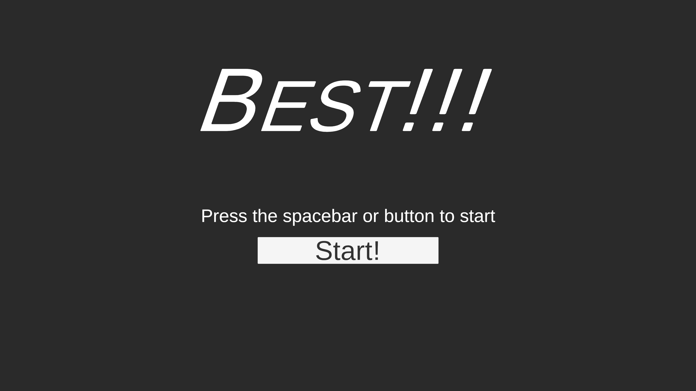
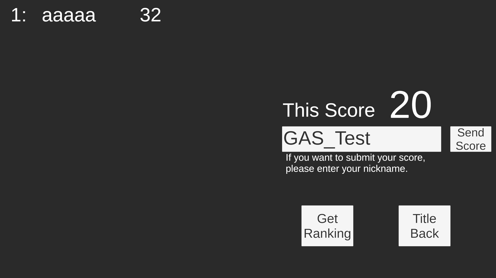
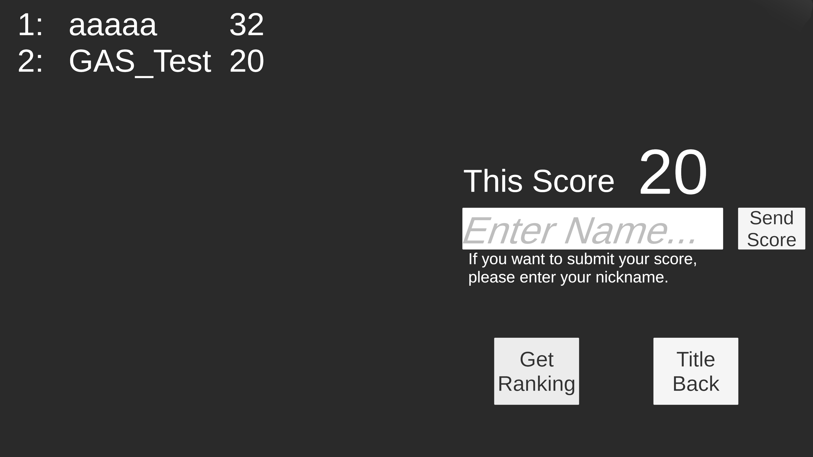
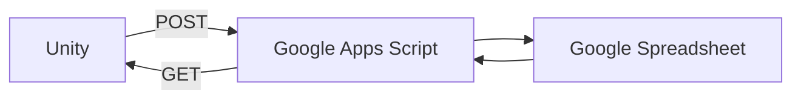

# GAS_Test (ゲームタイトル：BEST!!!)

Google Apps Script（GAS）の学習・検証用リポジトリです。

 *タイトル画面

## 目次
- [概要](#概要)
- [制作背景](#制作背景)
- [使用技術](#各使用技術)
- [ゲーム内容](#ゲーム内容)
- [実装した機能](#実装した機能)
- [システム構成](#システム構成)
- [通信処理](#通信処理)
- [工夫した点](#工夫した点)

## 概要
UnityとGoogle Apps Scriptを利用し、オンラインランキング機能の実装を目的として制作した検証プロジェクトです。
Googleスプレッドシートをデータベースとして利用し、スコア送信・ランキング取得・表示までの一連の通信処理を実装しました。
ゲーム内容は通信処理の検証を目的としたシンプルな構成にしています。

## 制作背景
これまでJSONを利用したローカルランキングの実装方法は知識としてありましたが、プレイヤー同士で共有できるランキングを実装したいと考え、本プロジェクトを制作しました。

## 各使用技術
| 項目       | 内容                    |
| -------- | --------------------- |
| 🎮 開発環境  | Unity 6               |
| 💻 言語    | C# / JavaScript (GAS) |
| 🌐 通信    | UnityWebRequest       |
| 📊 データ保存 | Google Spreadsheet    |
| ⚡ 非同期    | UniTask               |
| 📦 データ形式 | JSON                  |

## ゲーム内容
落下してくるオブジェクトを取得し、スコアを競うシンプルなゲームです。
ランキング機能の検証を目的として制作しているため、通信機能の実装に重点を置いています。

## 実装した機能
- Google Apps Scriptへのスコア送信
- Googleスプレッドシートへの保存
- ランキング取得
- Unityへのランキング表示
- JSON形式によるデータ通信
- UniTaskを利用した非同期通信
- 通信中の重複送信防止
- オブジェクト破棄時の通信キャンセル

## システム構成
### ランキング登録の流れ
1. **スコアを送信**
> ゲーム終了後、プレイヤー名を入力してスコアを送信します。  
> UnityではUnityWebRequestを利用して、プレイヤー名とスコアをJSON形式に変換し、Google Apps ScriptへPOST通信を行います。
>  *名前をInputFieldに入力後、フィールド右側のボタンでPOST通信開始

2. **Google Apps Scriptでデータを保存**
> 受け取ったJSONデータを解析し、Googleスプレッドシートへランキングデータとして保存します。  
> Google Apps Scriptを仲介することで、サーバーを用意せずにオンラインランキングを実装しています。

3. **ランキングを取得**
> GetRankingボタンを押すとGoogle Apps ScriptへGET通信を行い、Googleスプレッドシートから上位10人のランキングデータを取得します。  
> 取得したJSONデータをUnity側で解析し、ランキングUIへ反映します。

4. **ランキング表示**
> 取得したランキングをスコア順に表示します。  
> 通信処理にはUniTaskを採用し、オブジェクト破棄時にはWithCancellation()によって安全に通信を終了する設計になっています。
>  *スコア送信後再度ランキングを取得したとき

**通信処理のイメージ**  

## 通信処理

| クラス | 担当 |
| --- | --- |
| [ScoreSender.cs](GAS_Test/Assets/Scripts/ScoreScene/ScoreSender.cs) | スコア送信（POST） |
| [RankingGetter.cs](GAS_Test/Assets/Scripts/ScoreScene/RankingGetter.cs) | ランキング取得（GET） |

## 工夫した点
- 通信処理をUniTask化し可読性向上
- オブジェクト破棄時はWithCancellationで安全に通信終了
- Enumでログ管理し文字列の散在を防止
- 二重送信防止
- 通信処理とUI表示を分離

